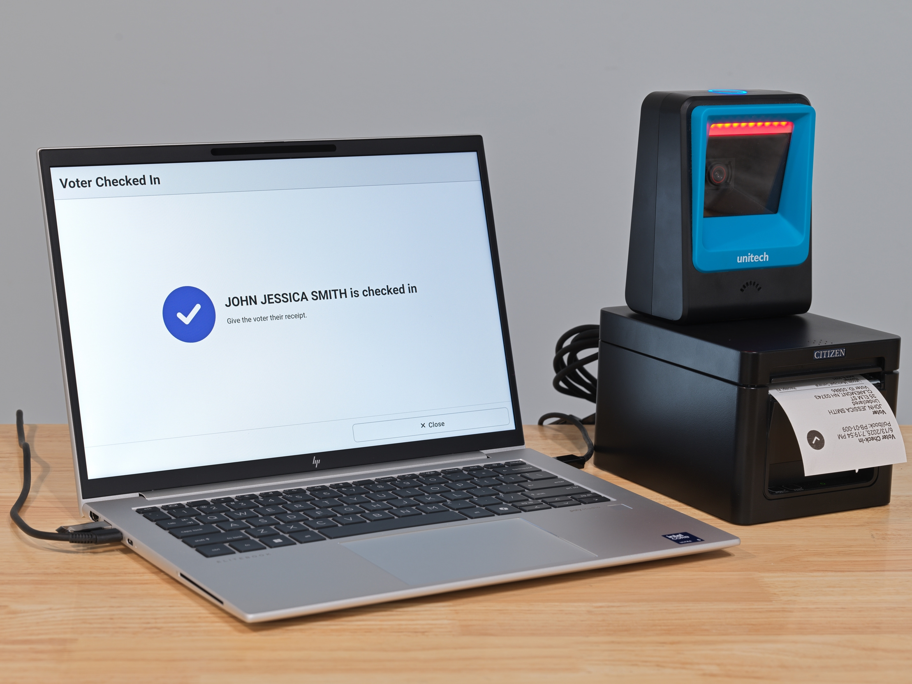

# VxPollBook Introduction

VxPollBook is an electronic poll book developed by [VotingWorks](https://voting.works) which aims to make the voter check-in process as fast, easy, and secure as possible.

<figure><figcaption></figcaption></figure>

If you're a poll worker looking for instructions on election day, read the [poll-worker-election-day-guide.md](poll-worker-election-day-guide.md "mention").

If you're an election manager, system administrator, or other election official, read through the following instructions and checklists to learn how to use VxPollBook from the start to the end of an election.

## Product Highlights

* **Fast Voter Processing** - The check-in process is designed to be as fast as possible. Large fonts and on-screen guidance mean training takes minutes rather than hours.
* **Easy, Secure Networking** - VxPollBook is designed to operate without an internet connection. At each precinct, poll books automatically connect to one another to form a wireless "mesh network." There's no need for wi-fi or special network setup at every location.
* **Paper Backup** - Print an up-to-date paper checklist at any time. Switch to the backup in minutes if you need to.&#x20;
* **Transparency** - VxPollBook is the only open-source poll book on the market, meaning that all code is publicly available at [https://github.com/votingworks/vxsuite](https://github.com/votingworks/vxsuite).
