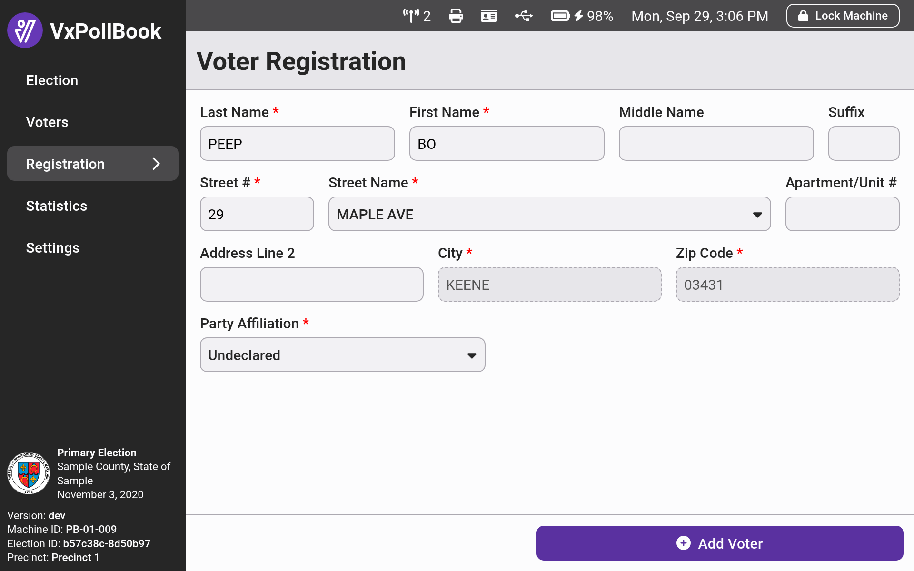
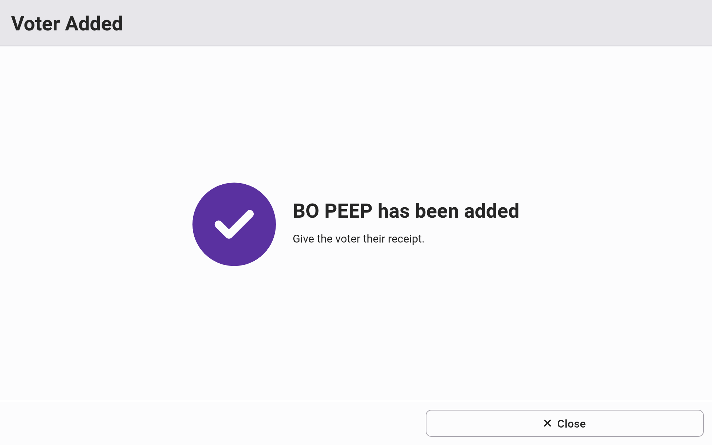
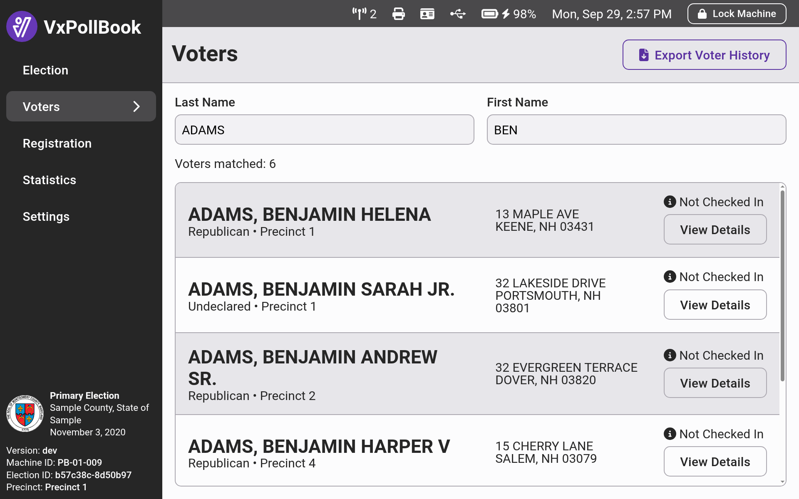
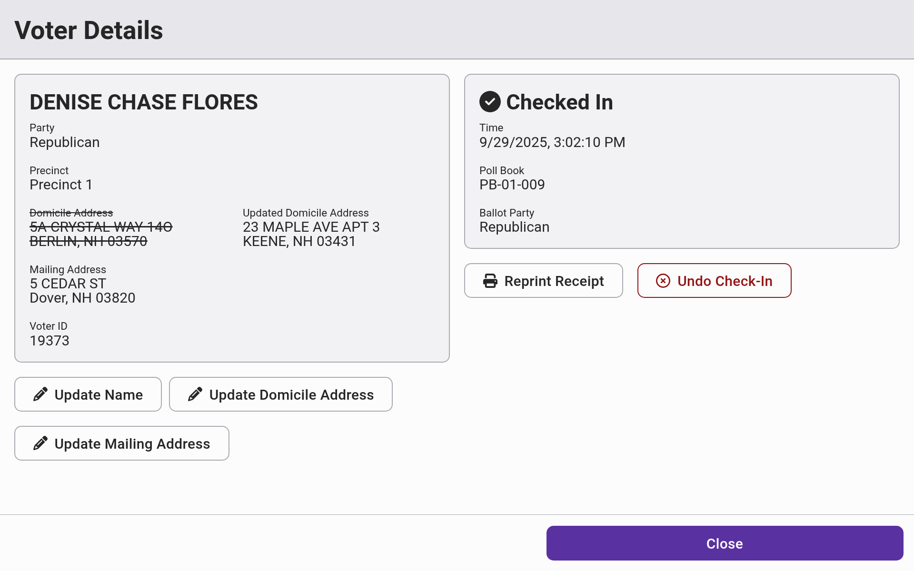
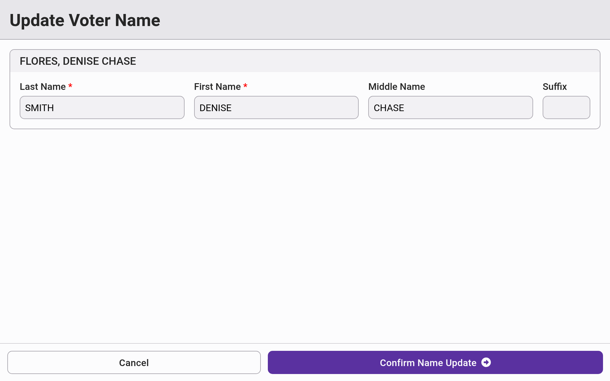
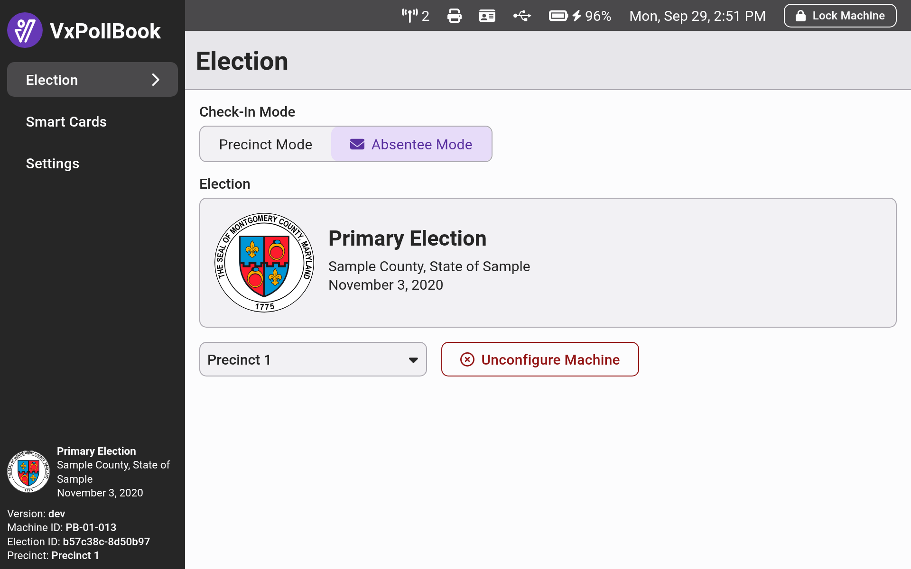
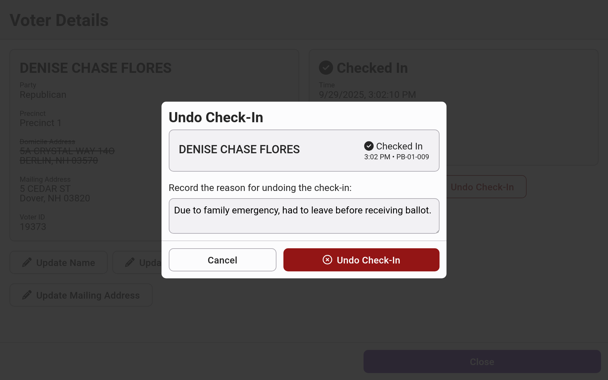
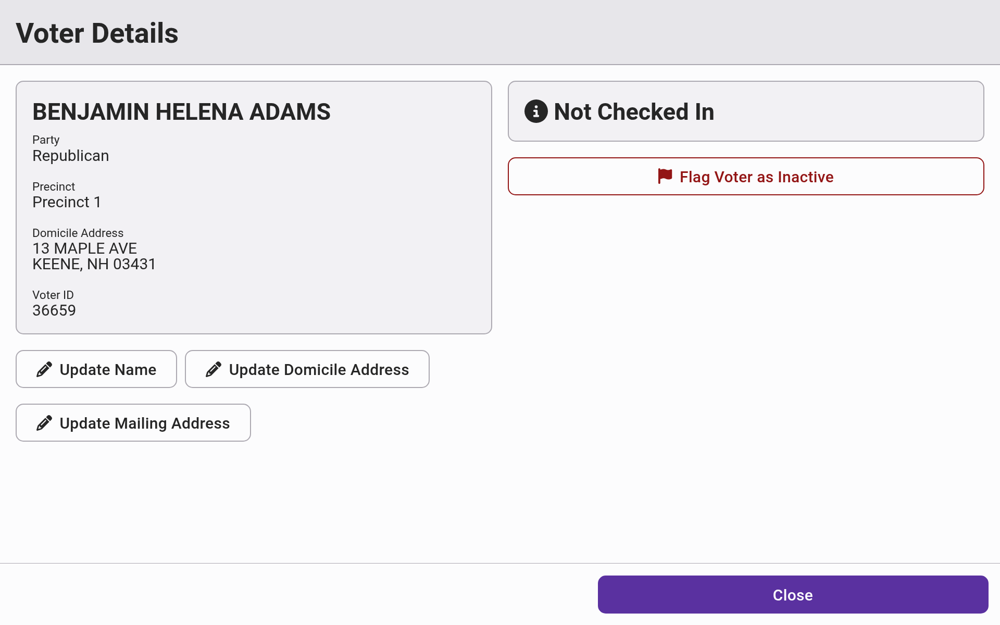
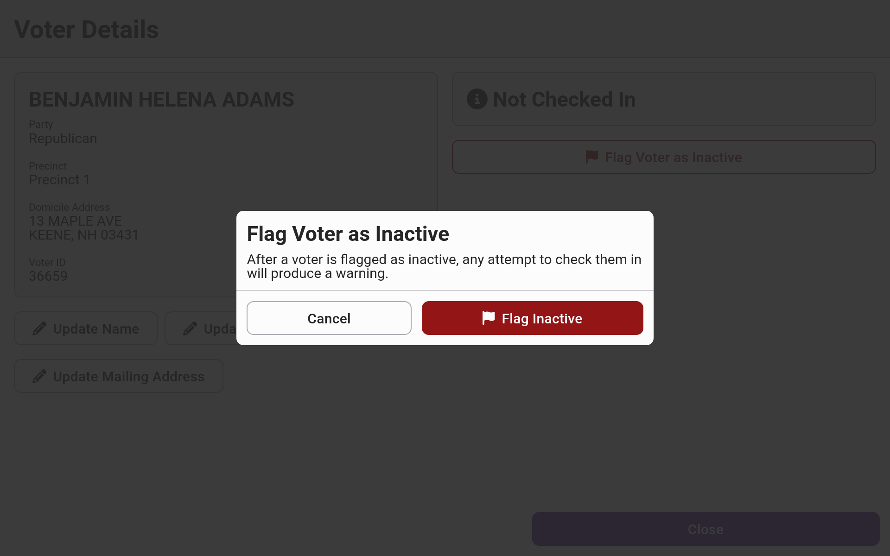
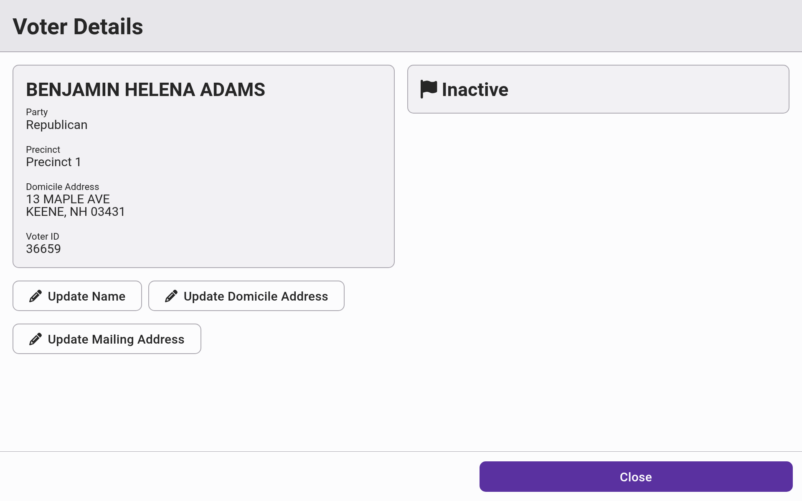

# Election Manager Election Day Guide

Election managers have more privileges and responsibilities than poll workers on election day. Poll workers - and _only_ poll workers - perform the actual voter check-ins. Election managers are responsible for:

* Adding newly registered voters
* Updating voters' name changes
* Viewing statistics on voter check-ins and registrations (see [statistics-and-exports.md](statistics-and-exports.md "mention"))

Election managers also have permissions to do the following, as necessary:

* Toggling to and from absentee mode
* Undoing check-ins if a voter was checked in accidentally
* Reprinting check-in receipts
* Flagging voters as inactive
* Updating voter addresses (although poll workers typically handle this)

## Adding New Voters

Election managers should navigate to the `Registration` tab to add newly registered voters. Enter the voter's information into the form. Only addresses associated with the precinct will be accepted. Select `Add Voter` to finish adding the voter. The printer will print a receipt with the details of the newly added voter.

<figure><figcaption></figcaption></figure> <figure><figcaption></figcaption></figure>


Adding a voter is not equivalent to a check-in. **The voter still needs to be checked in by a poll worker.** Typically, the new voter takes their new voter receipt to the check-in line where it is eventually stapled to the check-in receipt.&#x20;


## Updating Names

Election managers can navigate the full voter list under the `Voters` tab, where you can search for voters by scanning a driver's license or by manually searching their name. After you pull up the `Voter Details` page, select `Update Name`. Fill in the new name and select `Confirm Name Update` to finish. The printer will print a receipt with the details of the name change.

The voter will now appear under their updated name in search lists and on the check-in receipt.

<figure><figcaption></figcaption></figure> <figure><figcaption></figcaption></figure> <figure><figcaption></figcaption></figure>

## Setting Absentee Mode

VxPollBook can be in either precinct mode or absentee mode. In absentee mode, all check-ins by the poll worker are recorded as absentee check-ins.

VxPollBook can be switched between precinct and absentee mode during election day. For example, during slow times you might want to set one or more poll books to absentee mode to process absentee ballots, after which you would set them back to precinct mode.&#x20;

To change modes, navigate to the `Election` tab and select `Absentee Mode` or `Precinct Mode` to switch.

<figure><figcaption></figcaption></figure> <figure><figcaption></figcaption></figure>

## Undoing Voter Check-Ins

If a voter was incorrectly checked in due to poll worker error, an election manager can undo that voter check-in. From the voter's `Voter Details` page, tap `Undo Check-In`, provide a reason in the confirmation modal, and select `Undo Check-In` again to confirm. The printer will print a receipt with the details of the undone check-in.&#x20;

<figure><figcaption></figcaption></figure>

## Reprinting Check-In Receipts

Election managers can reprint voter check-in receipts. The most common reason you would need to reprint a receipt is if a receipt printer wasn't reloaded with paper before running out.&#x20;

Go to the `Voter` tab and navigate to the voter's `Voter Details` page. Select `Reprint Receipt`. The check-in receipt will reprint. It will clearly indicate that it is a reprinted receipt.

<figure><figcaption></figcaption></figure>

## Flagging Voters as Inactive

In some cases, voters may be become inactive (e.g. become ineligible to vote or pass away) after the voter list is finalized and election is fully configured. When that happens, you may flag those voters as inactive in VxPollBook.&#x20;

Go to the `Voter` tab and navigate to the voter's `Voter Details` page. Select `Flag Voter as Inactive` and then select `Flag Inactive` to confirm.

<figure><figcaption></figcaption></figure> <figure><figcaption></figcaption></figure> <figure><figcaption></figcaption></figure>

