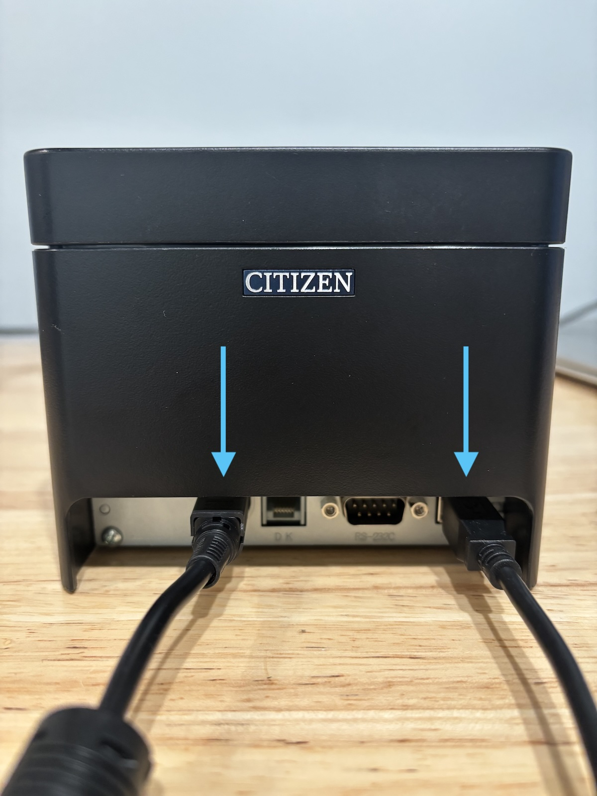
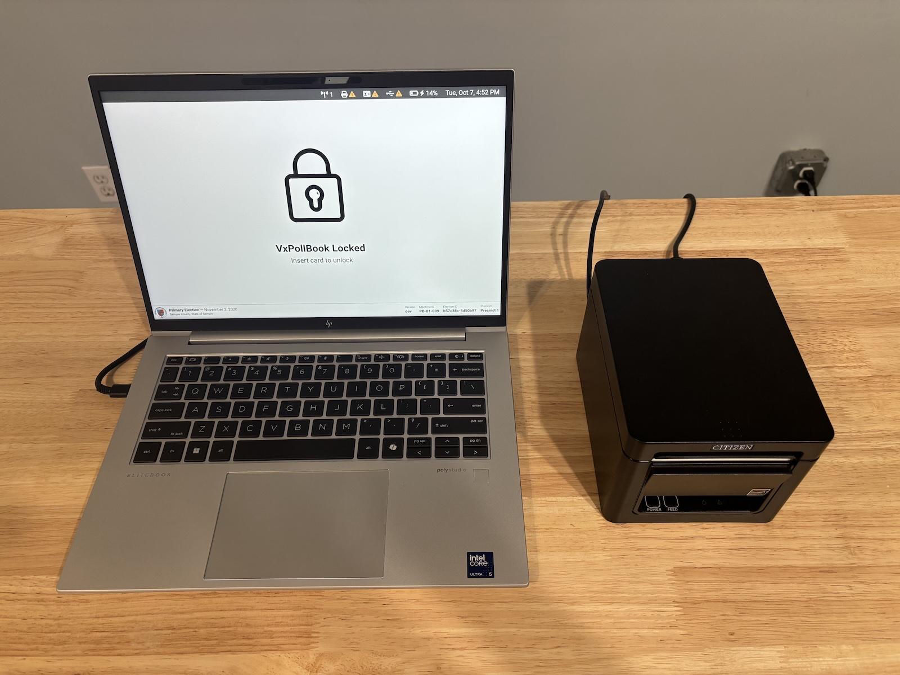
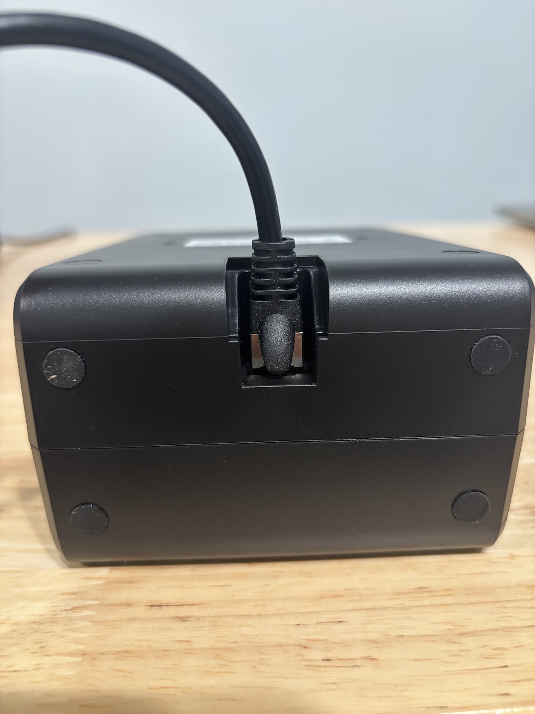
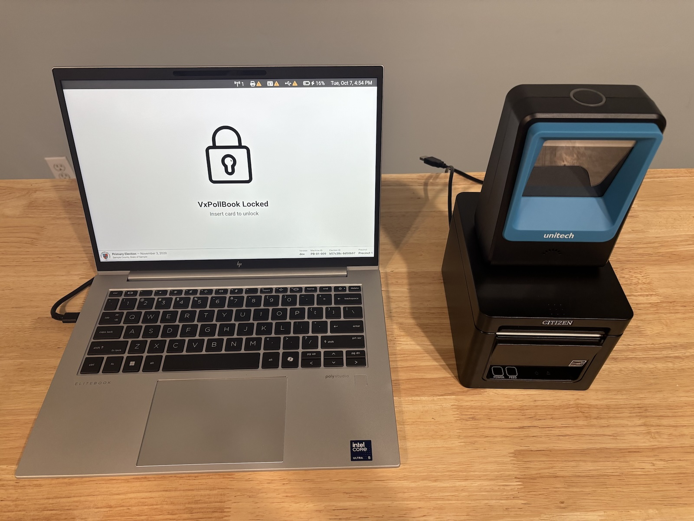
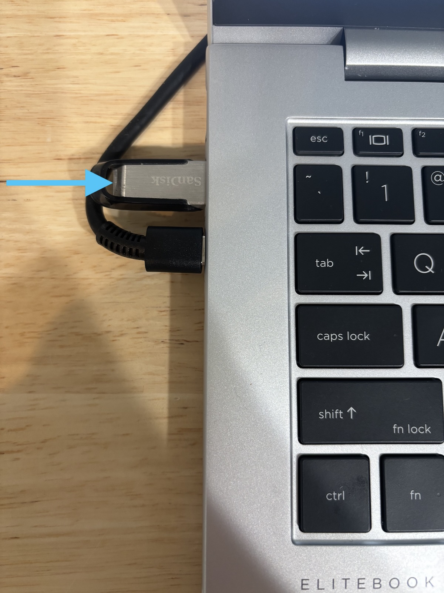
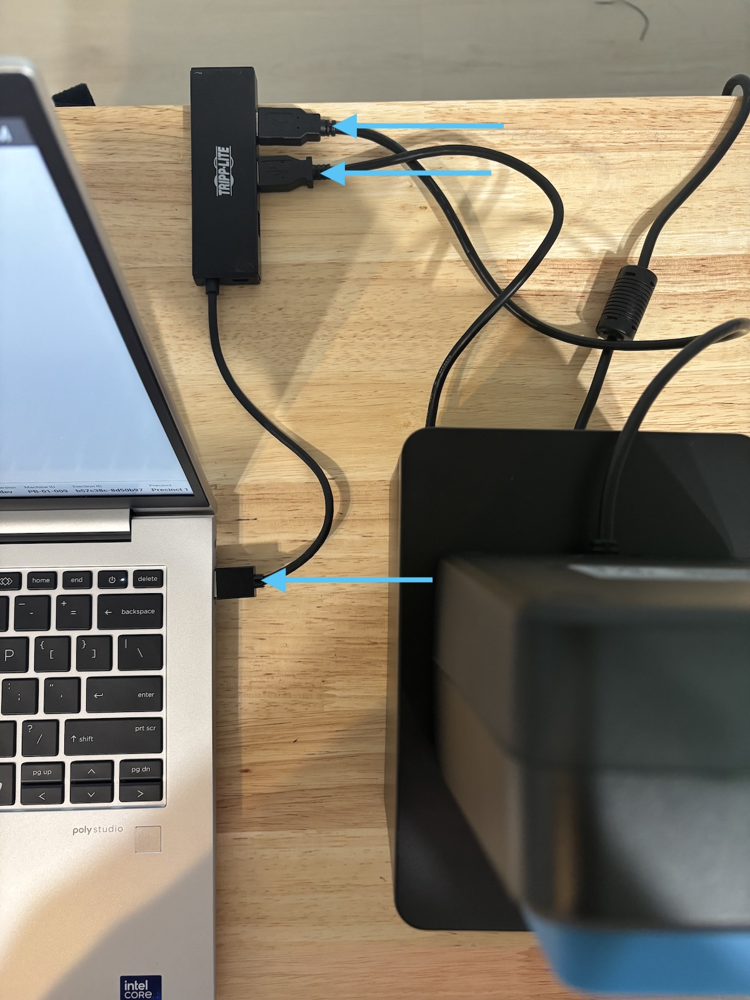
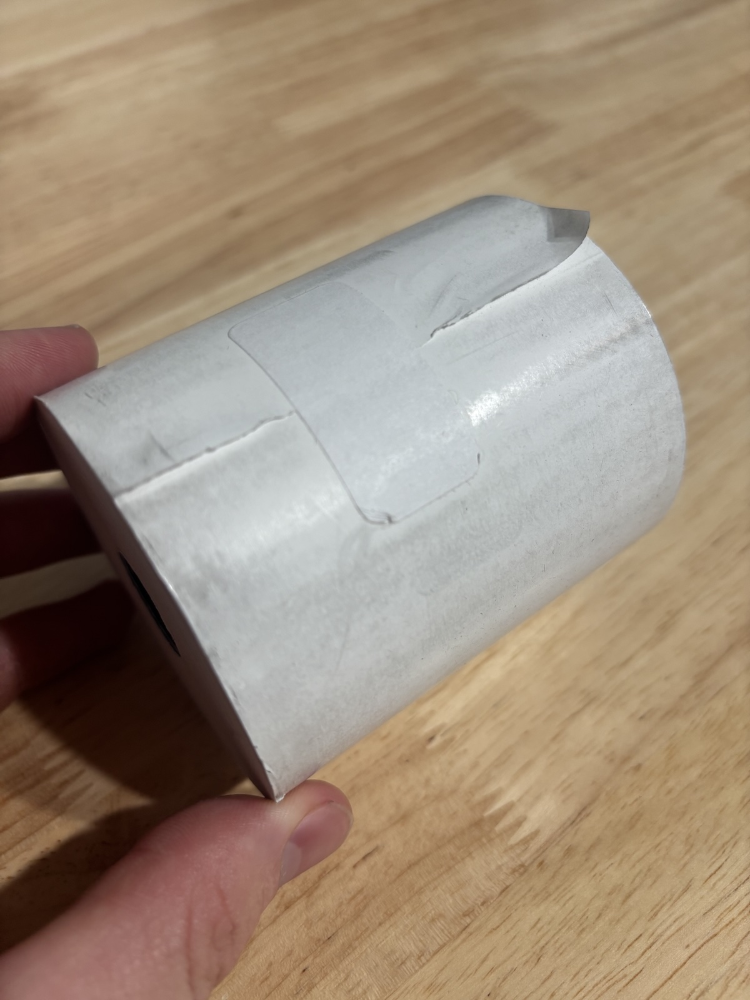
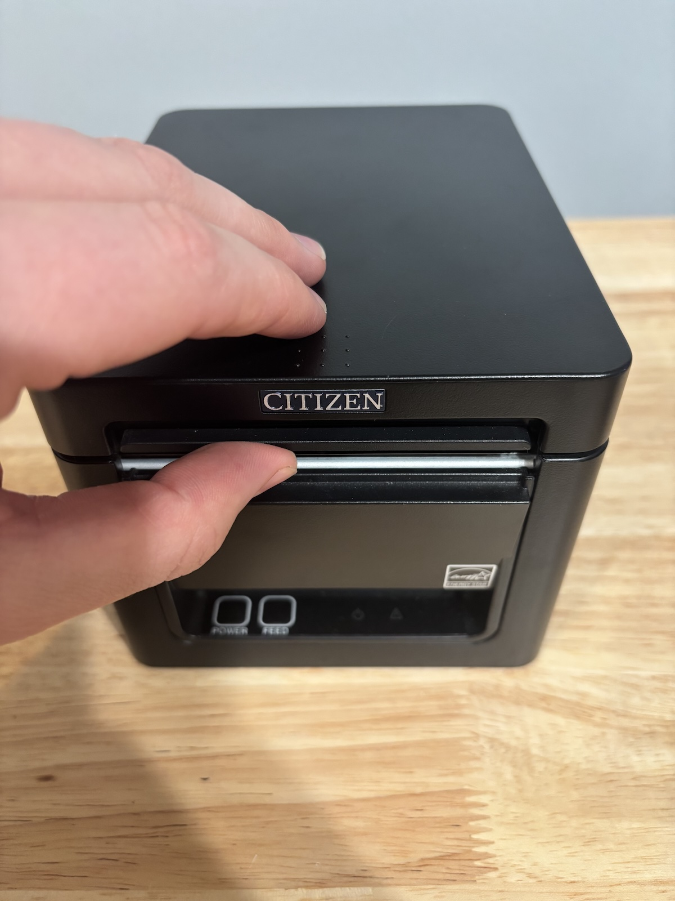
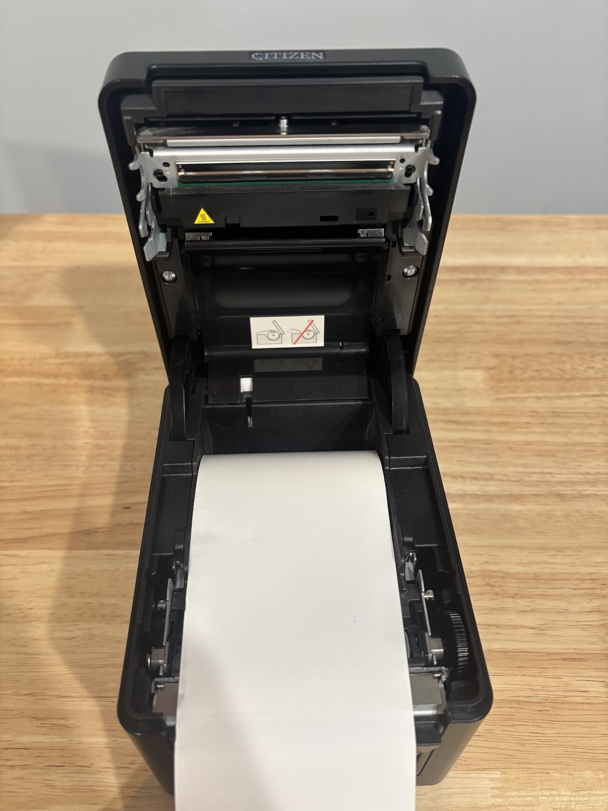
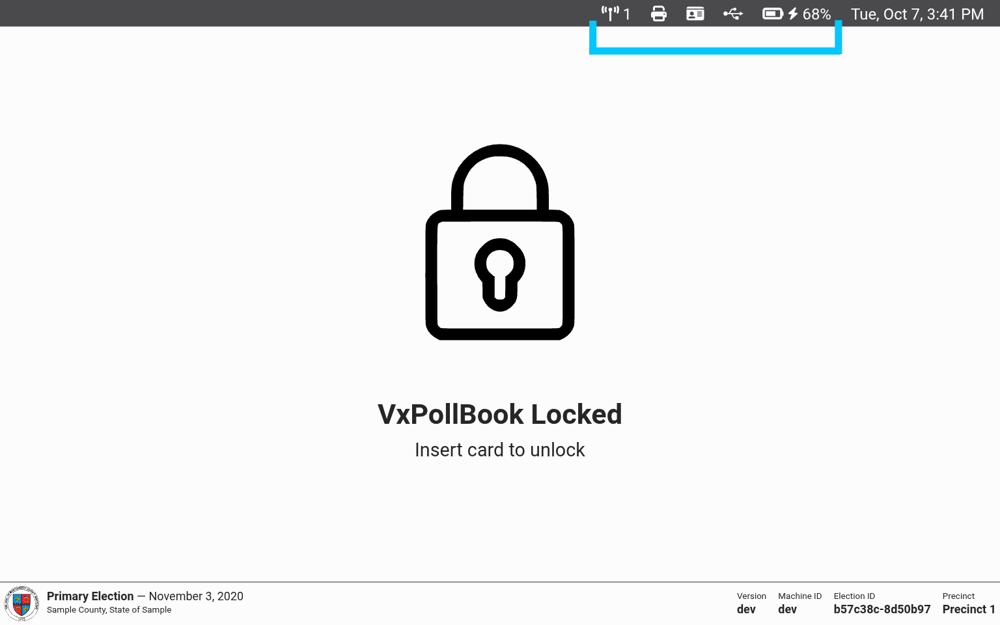

# Hardware Setup


Before you set up all of your poll books, ensure that you have enough outlets available via power strips and extension cords. Each poll book requires two outlets on election day — one for the laptop and one for the printer. We recommend using one power strip per two or three poll books, each connected to wall outlets directly or via extension cords.


## Laptop Setup

* [ ] Remove the laptop from the case and place it on the table
* [ ] Connect the laptop charger into an outlet
* [ ] Plug the laptop charger USB-C end into the laptop
* [ ] Open the laptop and press the power button in the top right

<figure><figcaption></figcaption></figure>

## Printer Setup

* [ ] Place the printer on table to the right of the laptop
* [ ] Connect the printer power cord into an outlet
* [ ] Plug the printer power cable into the back of the printer in the leftmost port
* [ ] Connect the printer USB cable into the back of the printer in the rightmost port

<figure><figcaption></figcaption></figure> <figure><figcaption></figcaption></figure>

## Barcode Scanner Setup

* [ ] Plug the cable with the clear plastic end into the back of the barcode scanner
* [ ] Place the barcode scanner on top of the printer

<figure><figcaption></figcaption></figure> <figure><figcaption></figcaption></figure>

## USB Connections

* [ ] Insert the USB drive into the laptop's left USB port
* [ ] Plug the USB hub into the laptop's right USB port
* [ ] Plug both the printer and barcode scanner USB cables into the USB hub
* [ ] (Optional) Plug the mouse into the USB hub

<figure><figcaption></figcaption></figure> <figure><figcaption></figcaption></figure>

## Load Printer Paper

* [ ] Remove tape from the paper roll so it can unroll
* [ ] Open the printer by pinching around the "Citizen" logo and lifting up
* [ ] Place the roll in the printer with the paper coming from the top of the roll toward you
* [ ] Close the printer over the extended paper

<figure><figcaption></figcaption></figure> <figure><figcaption></figcaption></figure> <figure><figcaption></figcaption></figure>

If the printer is turned on, it will automatically cut the excess paper after closing the lid.

## Final Check

You can use VxPollBook's status bar, in the top right of the screen, to confirm everything is fully set up:

<figure><figcaption></figcaption></figure>

If a component is not connected, you'll see a warning sign next to its icon. You can also confirm that the laptop is connected to power, the time is correct, and the number of connected poll books is correct.

<figure><figcaption>
Status bar with everything disconnected
</figcaption></figure> <figure><figcaption>
Status bar with everything connected
</figcaption></figure>

