# Poll Worker Election Day Guide

## Unlocking & Locking

To unlock the poll book, insert the poll worker card into the smart card reader on the left side of the laptop:

<figure><figcaption></figcaption></figure> <figure><figcaption></figcaption></figure>

After the card is fully inserted, the poll book will unlock and prompt you to remove the card. The poll book is now unlocked and can be used to process voters.

<figure>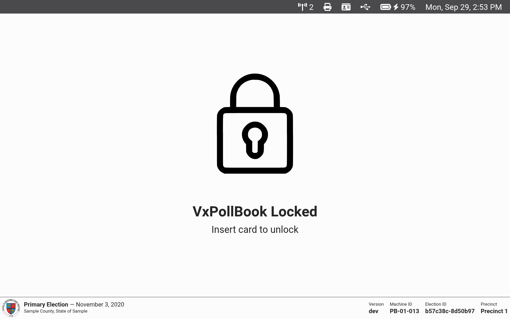<figcaption></figcaption></figure> <figure><figcaption></figcaption></figure> <figure>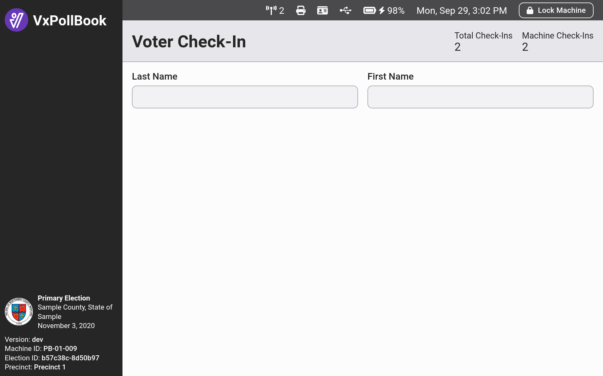<figcaption></figcaption></figure>

Anytime you step away from the poll book, select the `Lock Machine` button in the top right corner to log out.

<figure>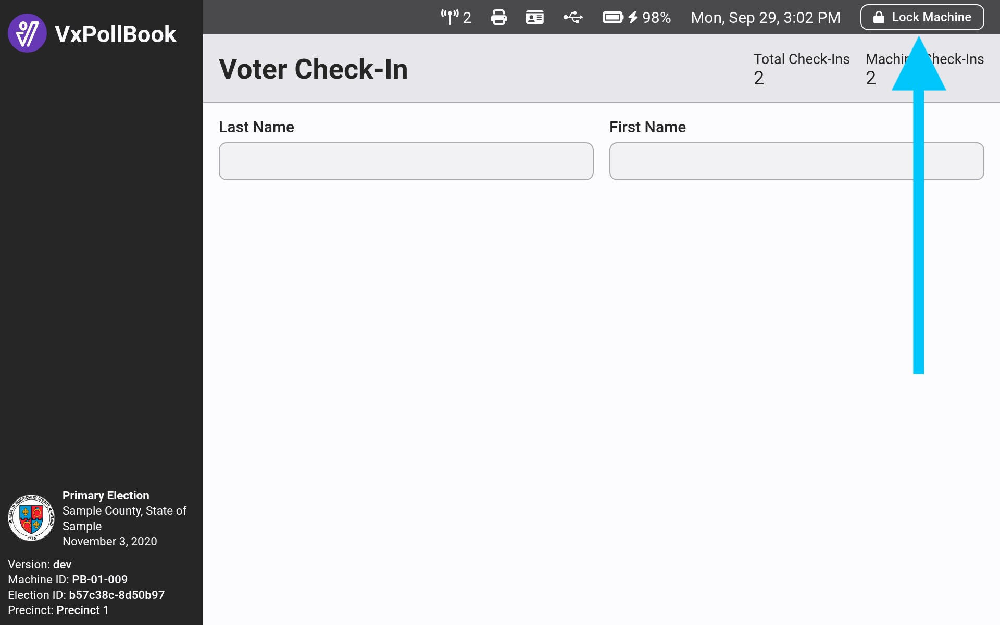<figcaption></figcaption></figure>

The poll book will also lock automatically after 30 minutes of inactivity.

## Voter Check-In

You're ready to start checking in voters if you've unlocked the poll book and see the `Voter Check-In` page.&#x20;

In most cases, you'll look up the voter by scanning the barcode on the back of the voter's driver's license. Hold the driver's license a few inches in front of the barcode scanner with the back of the license facing toward the scanner:

<figure>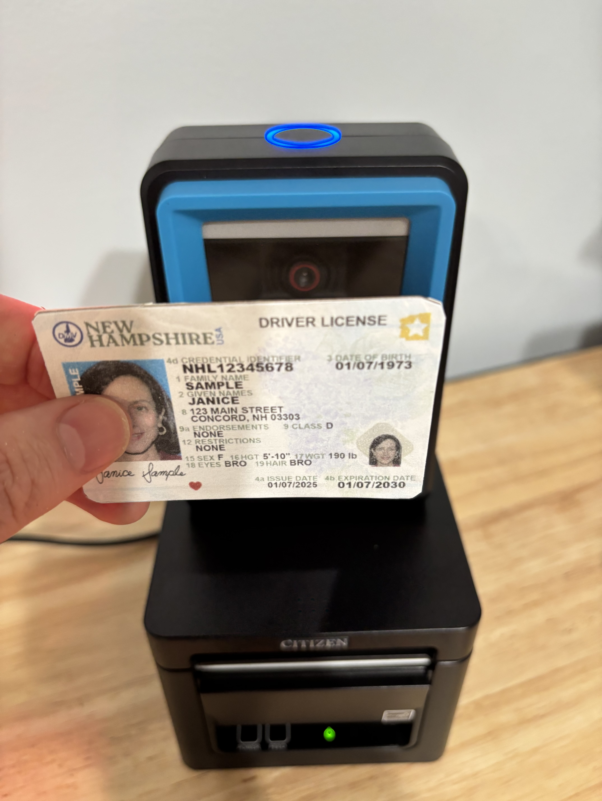<figcaption></figcaption></figure>

After the license is scanned, you'll hear a beep from the scanner. If the name on the license matches a registered voter, their information will appear on screen:

<figure>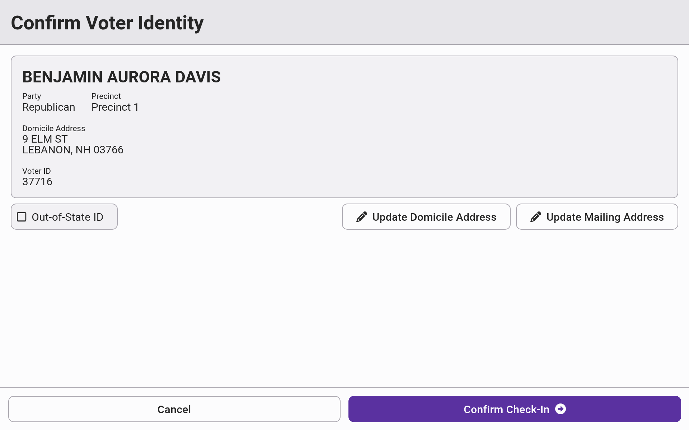<figcaption></figcaption></figure>

After you've confirmed the voter's information according to your jurisdiction's rules and regulations, select `Confirm Check-In`. The screen will show that the check-in was successful and a check-in receipt will print, which can be provided to the voter.

<figure>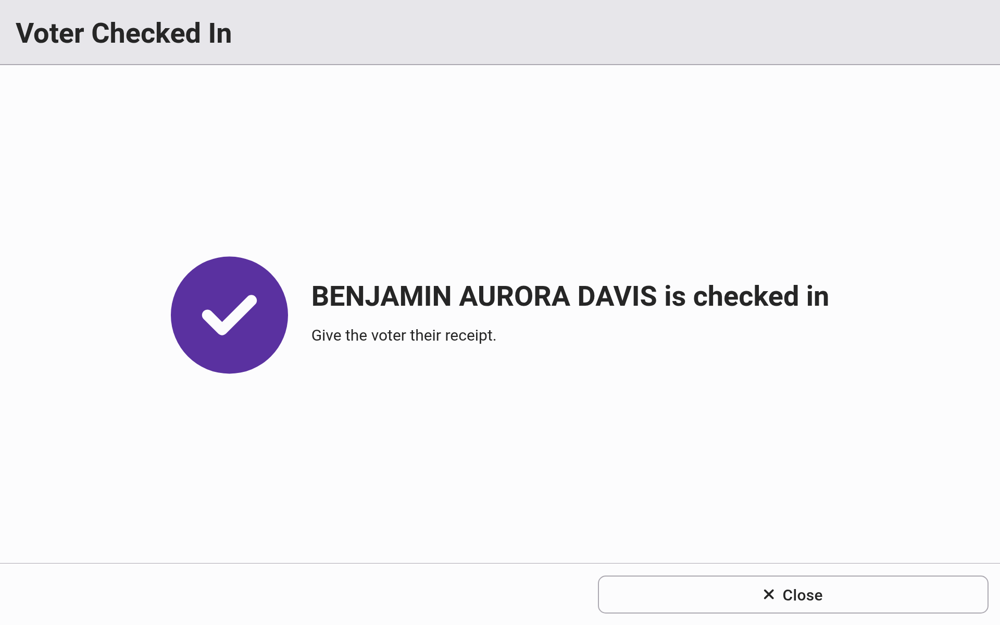<figcaption></figcaption></figure> <figure><figcaption></figcaption></figure>


If the check-in receipt has a red stripe on the side, that means that the thermal paper roll is nearing its end. Ask your election manager to replace your printer's paper.


## Manual Voter Lookup

If the voter does not use a driver's license as their method of identification, you will look up the voter manually. Type the voter's last and/or first name into the search bars to narrow the search results and find the voter in the list. Once you've identified the voter in the list, select `Start Check-In` to check them in.

<figure>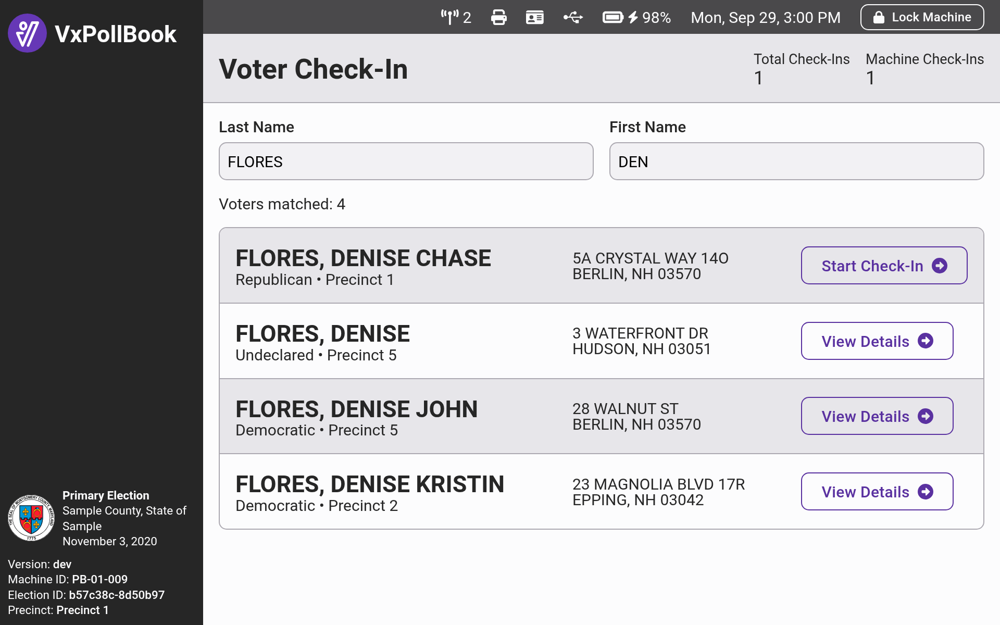<figcaption></figcaption></figure>

If the voter used an out-of-state driver's license, you must indicate that by checking the `Out-of-State ID` checkbox and selecting the state. When scanning a driver's license, this field is filled automatically.&#x20;

<figure>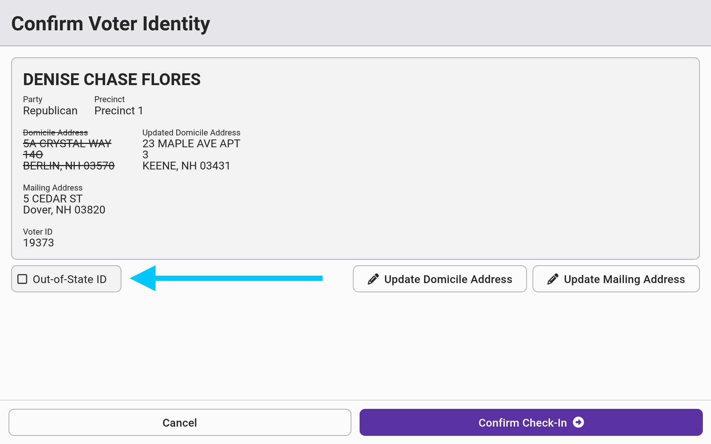<figcaption></figcaption></figure>

## Address Updates

If a voter's address has changed, you may update their address during check-in. Select `Update Domicile Address` on the voter's identification page to open an address update form. Enter the new address. Only addresses associated with the precinct will be accepted. Select `Confirm Domicile Address Update`  to confirm. An address update receipt will print and the poll book will return to the voter's identity page - **the voter still needs to be checked in** by selecting `Confirm Check-In`.

<figure><figcaption></figcaption></figure> <figure>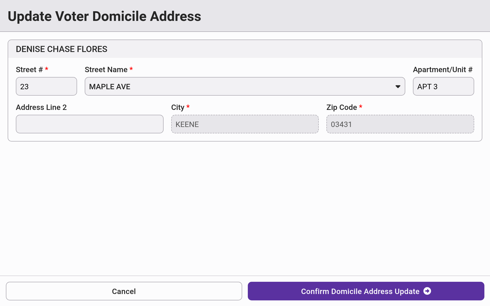<figcaption></figcaption></figure>


For voters with address updates, there will be at least **two** receipts - one for the address update and one for the check-in. Ask your election manager how to handle the address update receipts.


## Primary Elections: Undeclared Voters

In primary elections, there is one additional step in the check-in of undeclared voters. After confirming the voter's identity by selecting `Confirm Identity`, you'll be prompted to select the voter's choice of party. Select the correct party and then select `Confirm Check-In` .&#x20;

<figure>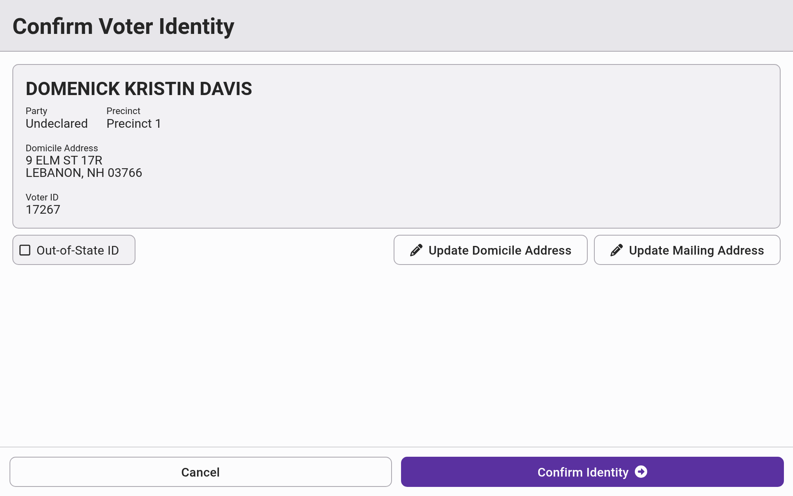<figcaption></figcaption></figure> <figure>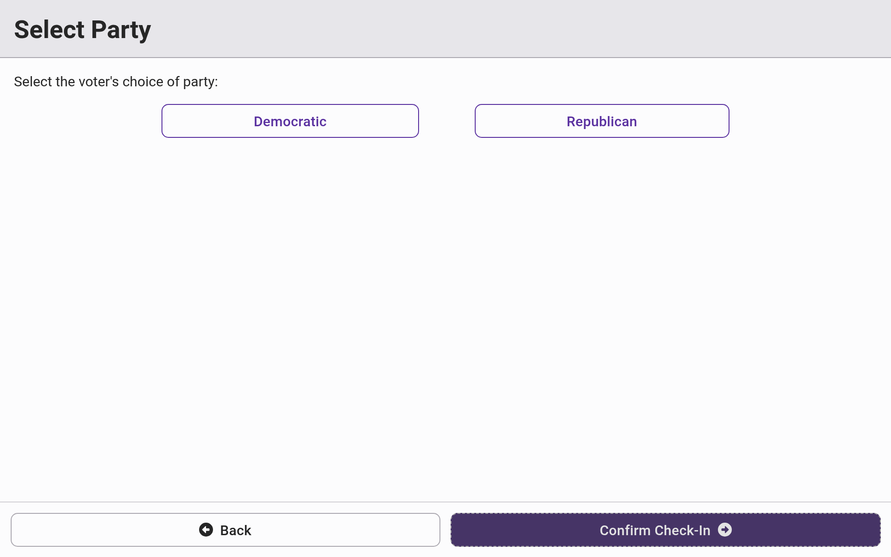<figcaption></figcaption></figure>

