# Pre-Election Setup

These instructions are also available in checklist form: [pre-election-setup-checklist.md](pre-election-setup-checklist.md "mention").

## The Poll Book Package

VxPollBook is configured with a "poll book package" provided by VotingWorks. Once your voter list is finalized, send your voter list and street list to VotingWorks support at [help@vx.support](mailto:help@vx.support). The support team will then create and send you a poll book package to configure your poll books. Copy the poll book package onto a USB drive.

## Configure VxPollBook

We recommend configuring one poll book as a system administrator using a USB drive and then configuring the rest of the poll books wirelessly as an election manager.


You do not need to set up the printers and barcode scanners for configuration and smart card programming.&#x20;


### Configure as a System Administrator

Select any poll book to configure first. The unconfigured poll book will prompt you to insert a system administrator card to log in and then insert a USB drive with the poll book package received from VotingWorks.&#x20;

To configure VxPollBook:

* [ ] Insert your system administrator card
* [ ] Enter your PIN
* [ ] Remove your system administrator card
* [ ] Insert the USB drive with the poll book package, VxPollbook will automatically begin loading your list of voters
* [ ] Select a precinct (not applicable for single precinct jurisdictions)

<figure>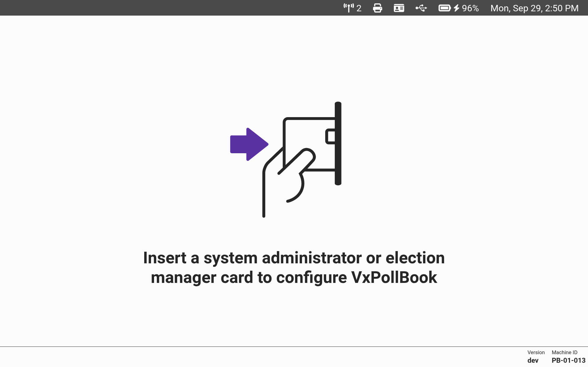<figcaption></figcaption></figure> <figure>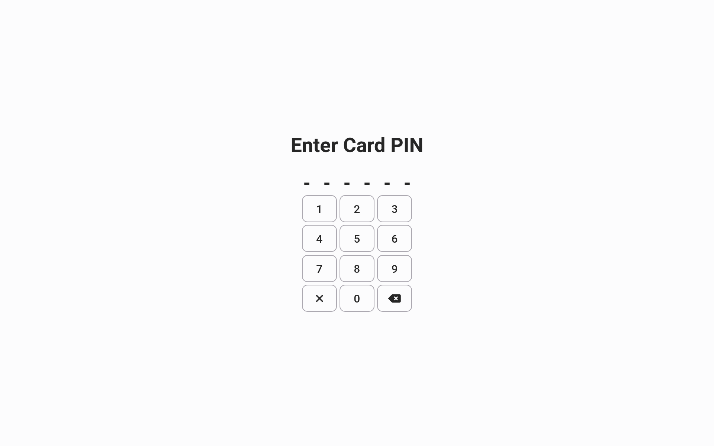<figcaption></figcaption></figure> <figure>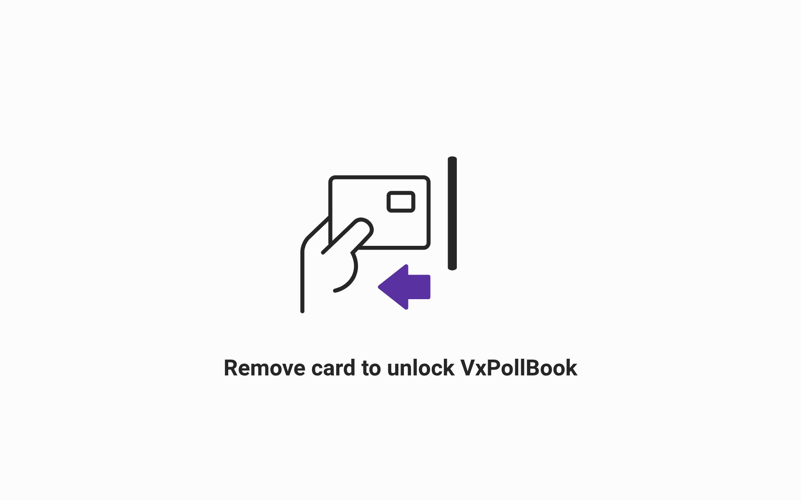<figcaption></figcaption></figure>

<figure>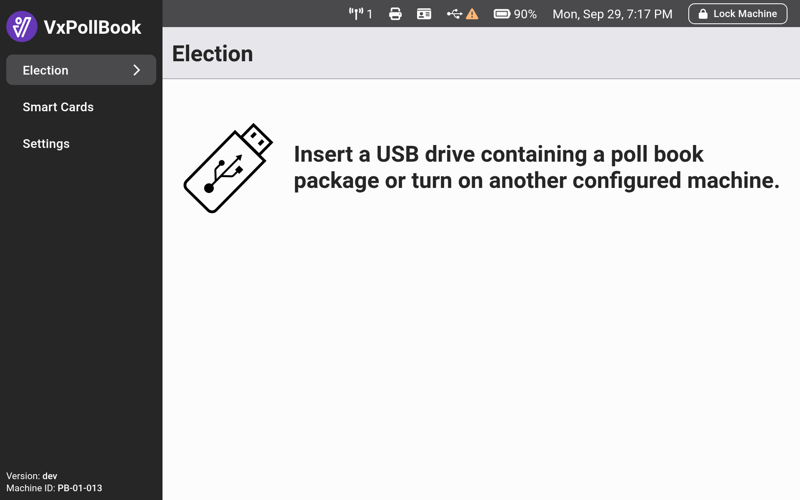<figcaption></figcaption></figure> <figure>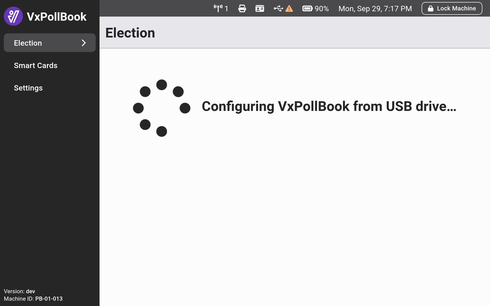<figcaption></figcaption></figure> <figure>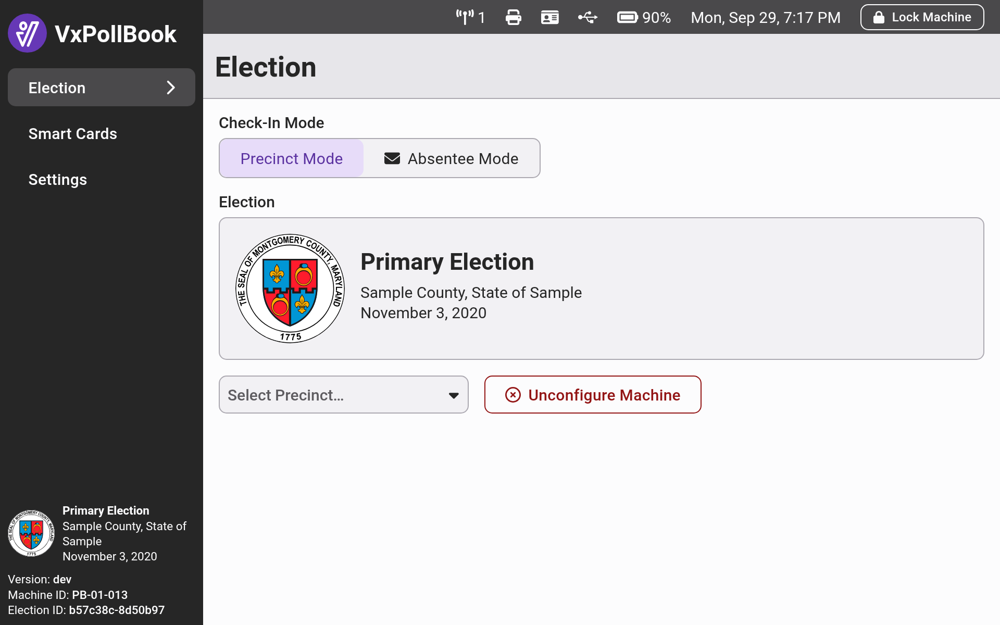<figcaption></figcaption></figure>

After configuration, you must select `Select Precinct...` and choose the precinct in which the poll book will be used. Each poll book can check in only voters whose addresses are in the  precinct selected.

<figure>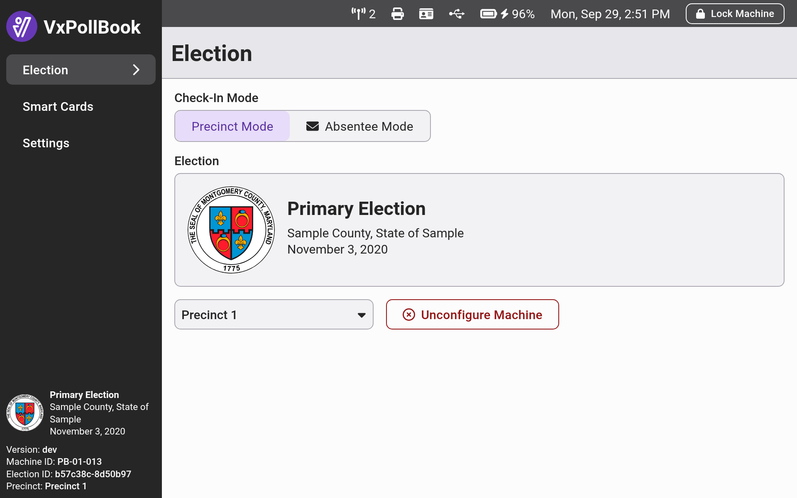<figcaption></figcaption></figure>

Now that one poll book is configured, configure the rest of the poll books over their local wireless network. We recommend [#configuring-as-an-election-manager](./#configuring-as-an-election-manager "mention"), which requires programming election manager cards first (see [#programming-smart-cards](./#programming-smart-cards "mention")).

### Configuring as an Election Manager

Election managers can only configure VxPollBook by connecting to an already configured poll book. Set up the remaining VxPollBook laptops.

Using an election manager card that was programmed for the election:

* [ ] Insert your election manager card
* [ ] Enter your PIN
* [ ] Remove your election manager card, VxPollbook will automatically begin loading your list of voters
* [ ] Select a precinct (not applicable for single precinct jurisdictions)
* [ ] Repeat these steps on each VxPollBook laptop

<figure>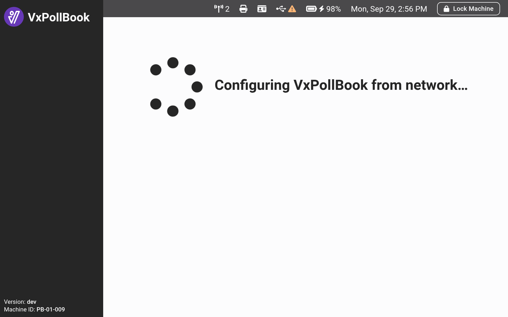<figcaption></figcaption></figure> <figure><figcaption></figcaption></figure> <figure><figcaption></figcaption></figure>

## Checking Network Details

To confirm that all your poll books are configured and connected, select the antennae icon at the top of the screen to open the `Network Details` table. After all machines are configured, confirm that:

* [ ] The number of poll books matches the number you expect
* [ ] The election hash (under `Election`) is the same for all poll books
* [ ] The poll books from the same precinct show as `Synced` to each other

If there is only one precinct in your election, all poll books should show as `Synced`.&#x20;

<figure>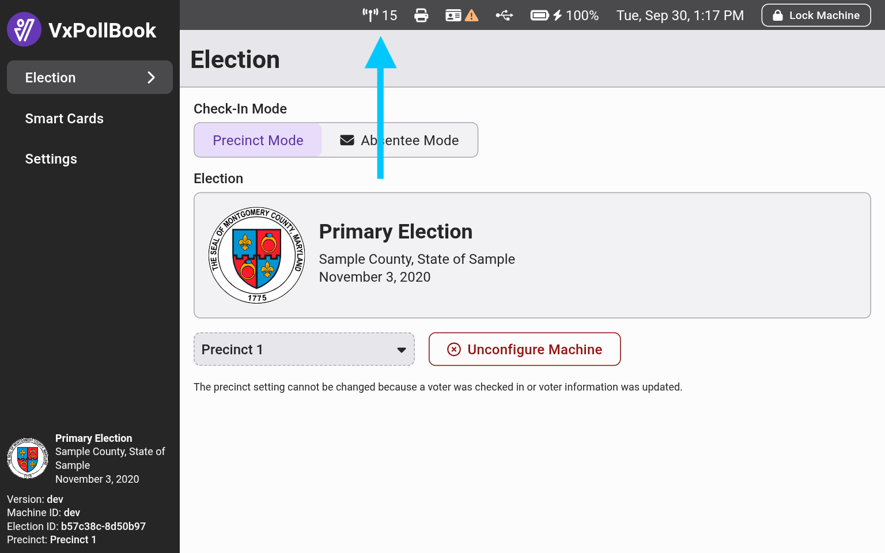<figcaption></figcaption></figure> <figure><figcaption></figcaption></figure>

## Programming Smart Cards


If you also use VotingWorks's voting system, you should program all of your cards at VxAdmin. Cards programmed at VxAdmin work with VxPollBook but not vice versa.


For each election, you will create election manager and poll worker cards specifically for that election. Smart cards can be created quickly and easily with VxAdmin or VxPollBook by logging in with a system administrator card and selecting _`Smart Cards`_ from the side menu.

Simply insert the card of your choice and select the correct button for the card.

<figure><figcaption></figcaption></figure>

When creating an election manager or system administrator card, the screen will show you a unique PIN for that card. Keep the PIN secure. When creating a poll worker card, the screen will simply confirm the card is created.

<figure>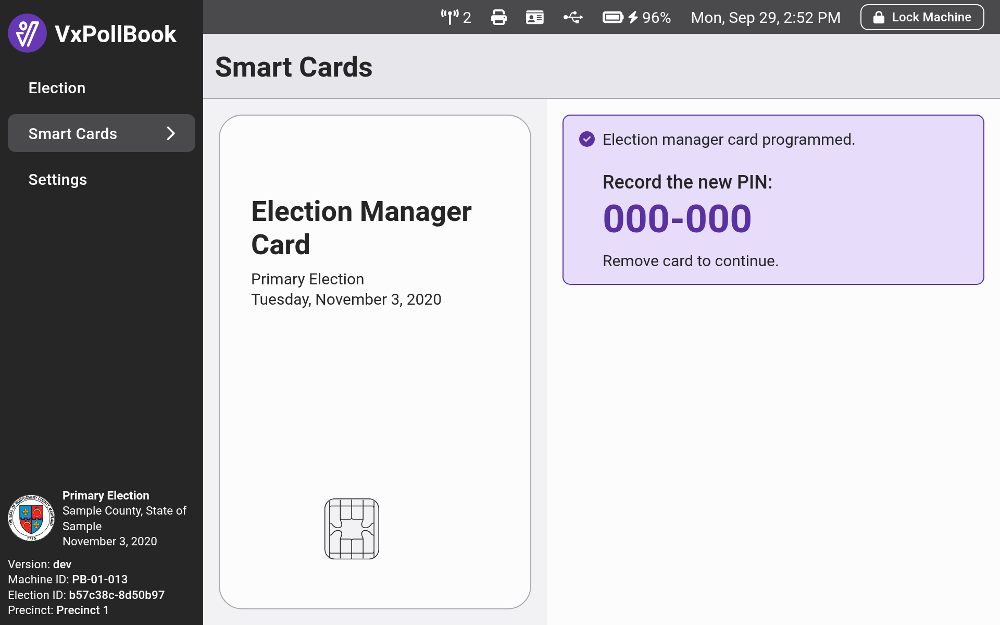<figcaption></figcaption></figure> <figure>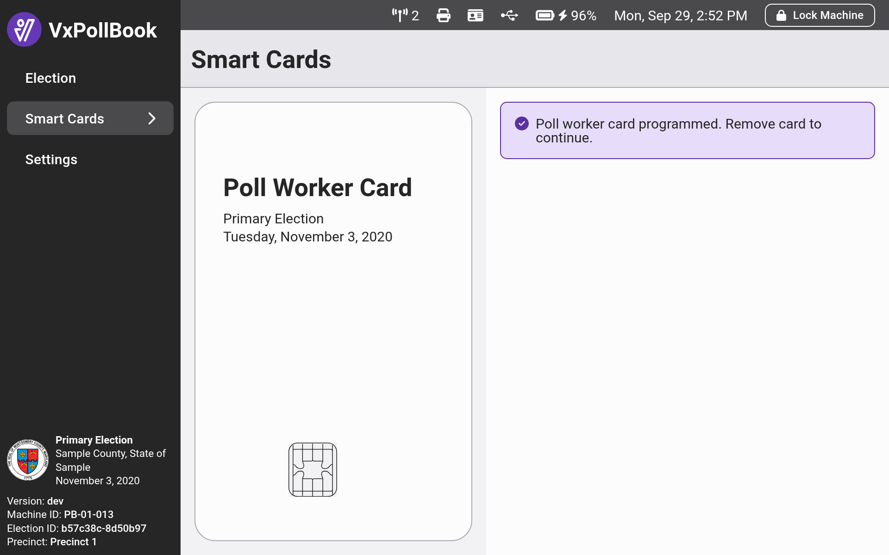<figcaption></figcaption></figure>

## Updating The Time

For each election, verify the date time shown at the top of the screen is correct. If not select _`Settings`_ ,  _`Set Date and Time`_ , update the date and/or time, and select _`Save`_.&#x20;

<figure>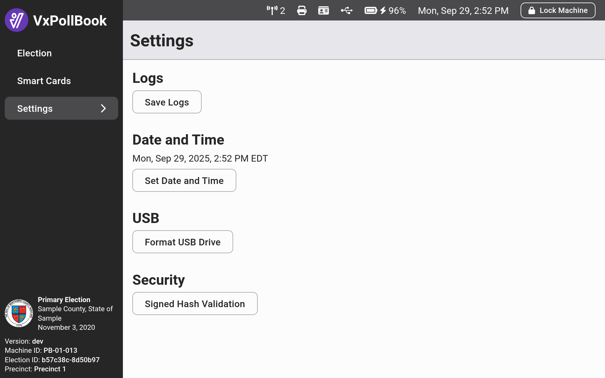<figcaption></figcaption></figure> <figure>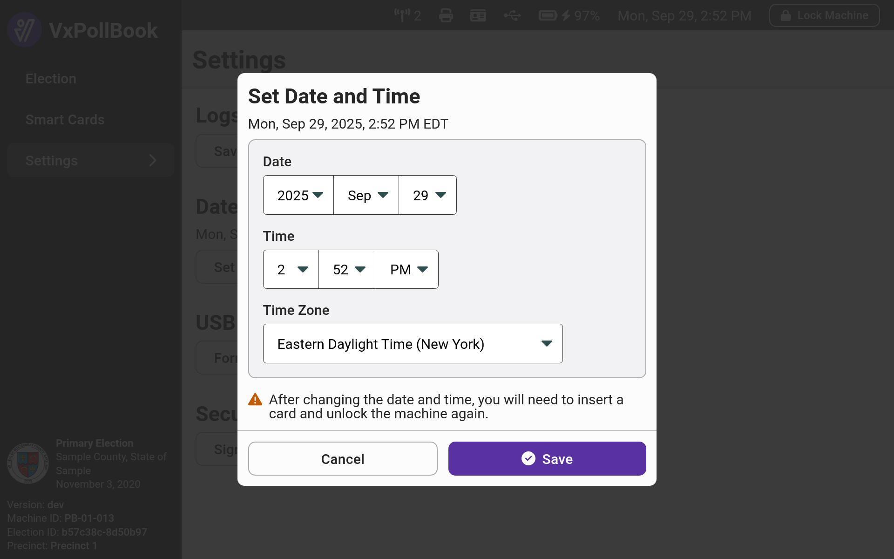<figcaption></figcaption></figure>

## Absentee Mode

VxPollBook has an absentee mode for processing absentee ballots, in which all check-ins are tracked as absentee check-ins. Each poll book's mode can be toggled from precinct to absentee and vice versa at any time by an election manager. You may either:

* **Toggle back and forth on election day**
  * Start election day in precinct mode to handle morning foot traffic
  * Switch to absentee mode in the afternoon during slow times to process absentees
  * Switch back to precinct mode before evening foot traffic
* **Designate absentee poll book(s) ahead of time**
  * During configuration, decide which poll books will process absentees and toggle the mode then

We recommend toggling back and forth on election day to have more poll books available for precinct check-ins at peak traffic times, but either way will work. See [#setting-absentee-mode](../election-manager-election-day-guide.md#setting-absentee-mode "mention") in the [election-manager-election-day-guide.md](../election-manager-election-day-guide.md "mention") if you are unsure how to switch the mode.
