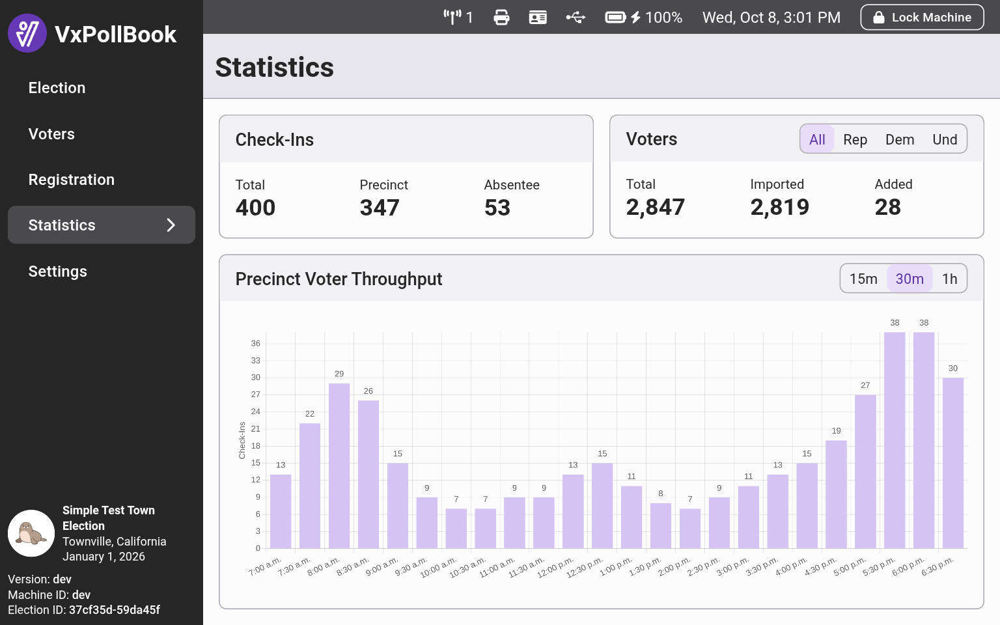
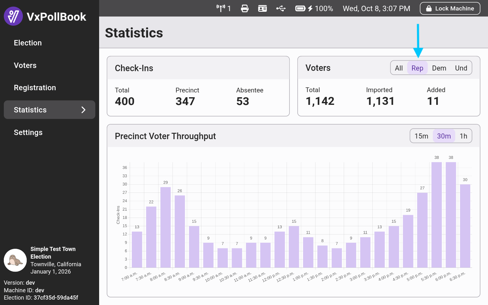
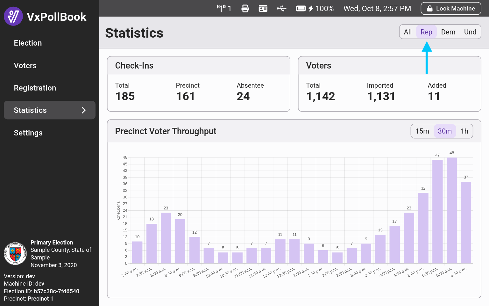
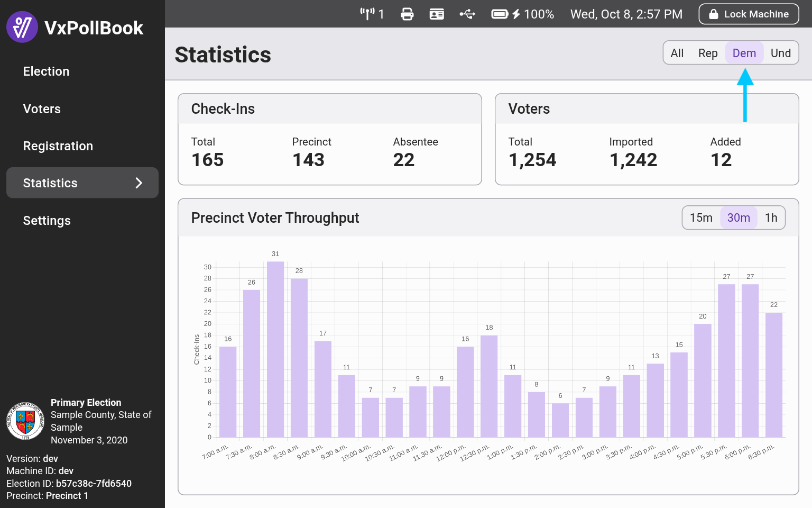
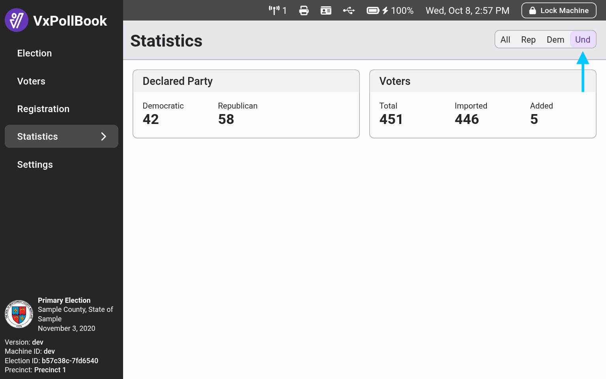
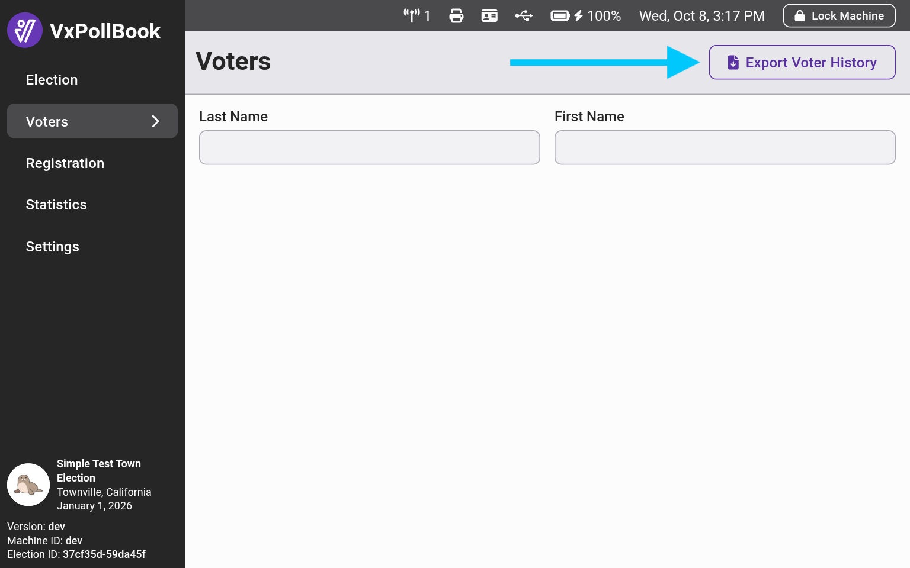
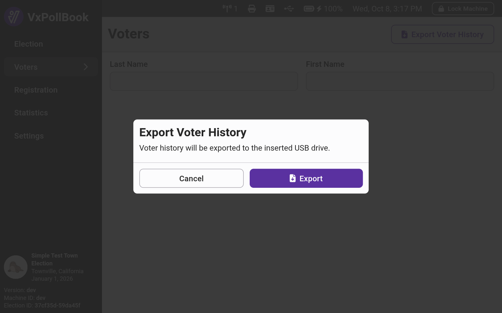

# Statistics & Exports

## Statistics

Election managers can access the statistics screen, which shows real-time counts for check-ins and newly added voters. The page can be used during an election day to monitor turnout and at the end of an election to get numbers for mandated reporting:

<figure><figcaption></figcaption></figure>

Use the toggle above the precinct voter throughput chart to view throughput data in different granularities - either 15 minute, 30 minute, or 1 hour intervals.

### General Elections

In general elections, you can view registered voter totals by party by using the toggle to the right of the `Voters` heading:

<figure><figcaption></figcaption></figure> <figure><figcaption></figcaption></figure>

### Primary Elections

In primary elections, there are also separate check-in statistics and throughput charts for each party. Use the toggle in the top right of the page to switch between statistics for each party. For undeclared voters, there's no dedicated check-in totals since undeclared voters are opting into one of the party primaries. Instead, you can see the number of undeclared voters who have declared for each party.

<figure><figcaption></figcaption></figure> <figure><figcaption></figcaption></figure> <figure><figcaption></figcaption></figure>

## Voter History Export

Under the `Voters` tab, election managers have an option to export a voter history file which is a `.csv` file containing the list of all check-ins. The list also indicates:

* Whether or not the check-in was absentee
* Whether the voter was newly registered
* Whether the voter had an address change
* Whether the voter had a name change
* The state of the driver's license, if out-of-state
* The party choice for undeclared voters in a primary
* The time of check-in
* The voter's name, address, and voter ID

The export is often useful for transferring check-in data to another system.

To export the file, log in as an election manager, navigate to the `Voters` tab, and select `Export Voter History`. Insert a USB drive if you have not already and select `Export`.&#x20;

<figure><figcaption></figcaption></figure> <figure><figcaption></figcaption></figure>

