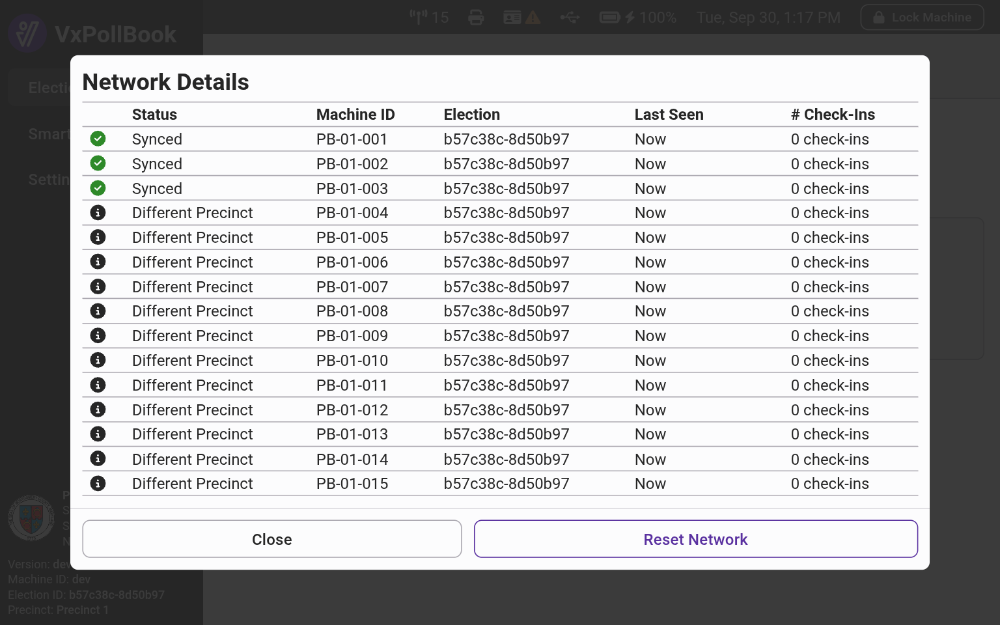

---
layout:
  width: default
  title:
    visible: true
  description:
    visible: false
  tableOfContents:
    visible: true
  outline:
    visible: true
  pagination:
    visible: true
  metadata:
    visible: true
---

# Troubleshooting FAQs

#### Why isn't VxPollBook connecting to all the other VxPollBooks?

In the top bar, VxPollBook shows the number of connected VxPollBooks:

<figure><figcaption>
Network Icon
</figcaption></figure>

The number includes the current laptop and should match the total number of VxPollBooks in use. If the number is lower than expected, your poll books may be too far apart. Select the network icon to see which poll books are detected and which are not. If your poll books are close together (within 25 yards and unobstructed by walls) but still not seeing each other - or if there is a warning icon next to the network icon - select the network icon and then select `Reset Network` . Wait a minute for VxPollBook to reconnect. If the number is still not what you expect, restart the laptop.

<figure><figcaption></figcaption></figure>

#### VxPollBook says the printer is not connected, but it is connected!

Confirm the printer is connected to power. Try disconnecting the printer USB cable from the laptop and reconnecting it. If it still is not detected, reboot the computer.

#### VxPollBook says the USB drive is not connected, but it is connected!

Try disconnecting and reconnecting the USB drive. If this does not work, reboot the computer.
